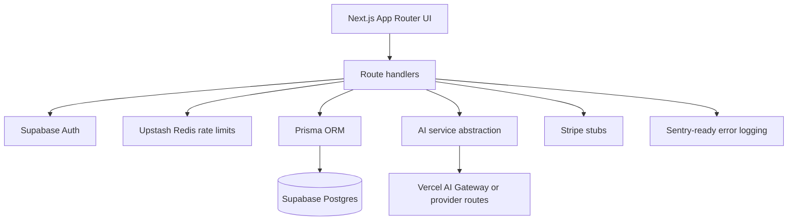

# Prompt Intelligent Grader

PIG, short for Prompt Intelligent Grader, is a production-light SaaS foundation for evaluating, scoring, rewriting, and tracking AI prompts.

Tagline: “Grade your prompts before AI grades your results.”

## Features

- Dark-mode-first SaaS UI with landing, auth, dashboard, history, result, settings, and admin/dev pages.
- Supabase Auth with protected dashboard routes.
- Prisma/Postgres schema for users, evaluations, versions, test runs, templates, usage events, and Stripe-ready subscriptions.
- Server-side AI provider abstraction for default, OpenAI, Anthropic, and Gemini routes.
- Zod validation for request inputs and AI structured outputs.
- Upstash Redis rate limiting with in-memory local fallback.
- Secret detection for likely API keys/private keys before evaluation.
- Stripe-ready checkout, portal, and webhook stubs.
- Sentry-ready initialization.
- Unit tests for scoring, schemas, model registry, rate limits, and local evaluation fallback.

## Tech Stack

Next.js App Router, TypeScript, Tailwind CSS, shadcn-style owned components, Framer Motion, Supabase Auth, Supabase Postgres, Prisma ORM, Zod, Vercel AI SDK, Upstash Redis, Stripe, Sentry, Vitest.

## Architecture



## Environment Variables

Copy `.env.example` to `.env.local` and fill in:

- Supabase: `NEXT_PUBLIC_SUPABASE_URL`, `NEXT_PUBLIC_SUPABASE_ANON_KEY`, `SUPABASE_SERVICE_ROLE_KEY`
- Database: `DATABASE_URL`, `DIRECT_URL`
- AI: `AI_GATEWAY_API_KEY` plus optional model env vars
- Redis: `UPSTASH_REDIS_REST_URL`, `UPSTASH_REDIS_REST_TOKEN`
- Stripe: `STRIPE_SECRET_KEY`, `STRIPE_WEBHOOK_SECRET`, `NEXT_PUBLIC_STRIPE_PUBLISHABLE_KEY`, `STRIPE_PRO_PRICE_ID`
- Sentry: `SENTRY_DSN`

AI calls run server-side only. If no AI credentials are present, local development uses a deterministic evaluator so tests and UI flows still work.

## Local Development

```bash
npm install
npm run prisma:generate
npm run dev
```

Then open `http://localhost:3000`.

Run checks:

```bash
npm run lint
npm run typecheck
npm test
```

## Supabase Setup

1. Create a Supabase project.
2. Add the Supabase URL and anon key to `.env.local`.
3. Set `DATABASE_URL` to the pooled Postgres connection string.
4. Set `DIRECT_URL` to the direct connection string for migrations.
5. Run Prisma migrations.
6. Run `supabase/policies.sql` in the SQL editor to enable RLS policies.

## Prisma

```bash
npm run prisma:migrate
npm run prisma:generate
npm run seed
```

The seed script adds public prompt templates and a demo evaluation record.

## Vercel Deployment

1. Push the repository to GitHub.
2. Import the project in Vercel.
3. Add all environment variables from `.env.example`.
4. Enable Vercel AI Gateway or provide provider API keys.
5. Use a Supabase pooled database URL for runtime and direct URL for migrations.
6. Deploy.

Recommended build command:

```bash
npm run build
```

## Security Notes

- Dashboard routes are protected by Supabase middleware.
- API routes validate inputs with Zod and enforce Prisma ownership checks.
- RLS SQL policies are provided for Supabase table access.
- Service role keys are never used in client components.
- AI calls happen only in server route handlers.
- Prompts are size-limited and likely secrets are blocked.
- Rate limits are plan-aware: Free 5/day, Pro 100/day, Premium 500/day.

## Optional Production Work

- Add live Stripe price IDs for all plans and persist subscription updates in the webhook.
- Configure Sentry DSN and release tracking.
- Add team accounts, admin editing for rubric/model/plan configs, exports, and richer audit logs.
- Replace the local fallback evaluator with required AI credentials in strict production environments.
